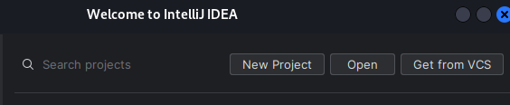
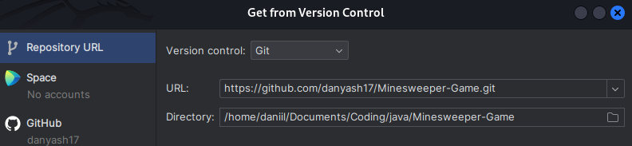
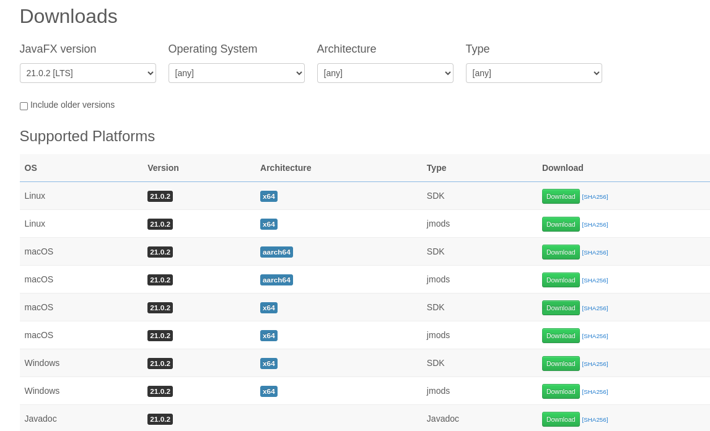
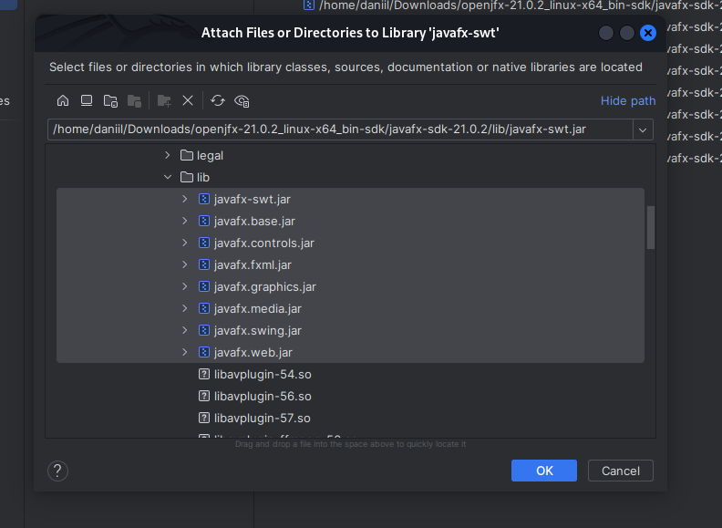
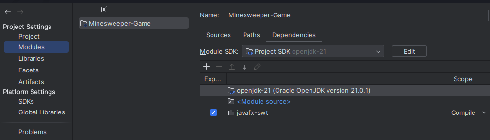
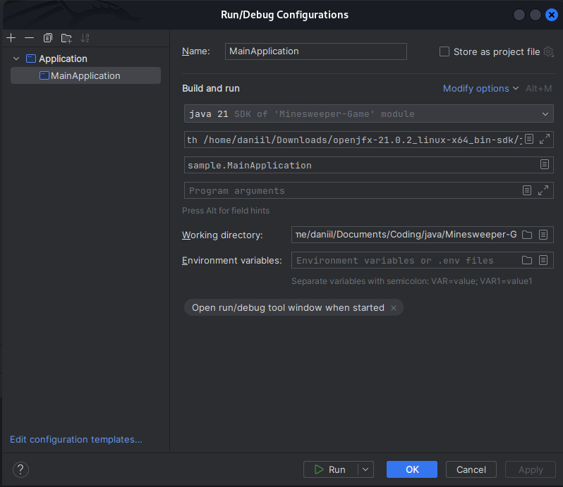
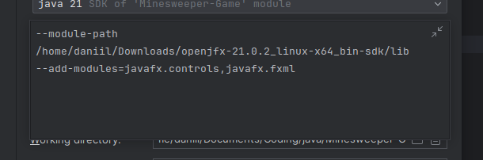
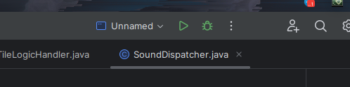
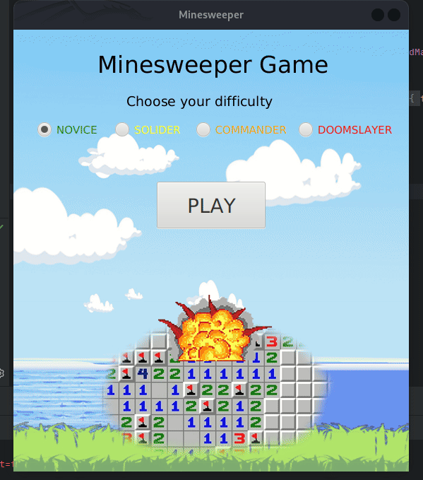

# Minesweeper

My first ever gamedev experience. This is a classic Minesweeper game written using JavaFx.

## Installation
    
To be honest - installation process is a little goofy. Back at the time I wasn't aware of how to do a portable and cross-platform application. If you're struggling with installation, contact me. There is a tutorial on how to play a game using Intellij Idea:

First, install Intellij Idea IDE, if you don't have it. Start IDE and select "Get from VCS".


Paste current repo URL and click Clone.


Now you have a game in your computer. After that comes the goofy part - you need to manually import JavaFX SDK into project in order for it to work. I know, I know, I should've used Maven! :D

Anyway, go to https://gluonhq.com/products/javafx/ and download SDK for your operating system. I've tried using 21.0.2 and it worked.


Now get back to Intillij, select File->Project Structure->Libraries. Press + sign, find unpacked JavaFX SDK folder, open it, then open **lib** folder and select all .jar files.



Click OK and go to Modules. Select Dependencies at right section. Check **javafx-sft** if it's present. If not, leave it as it has.


And the last step. Close Project Structure, find **Current file** label, click, then click **Edit configurations**. Click **Add new configuration** Choose **Application**. Select or enter the main class - sample.MainApplication. Click **Modify options**, then click "Add VM options". At VM options field, paste the following string:

```bash
  --module-path
    <path-to-javafx-sdk>/lib
  --add-modules=javafx.controls,javafx.fxml
```

Please make sure to paste YOUR path to JavaFX SDK instead of <path-to-javafx-sdk>. Save the configuration.



After that, you're finally ready to run a game, Just click that green sign at right top.


## Game demo


